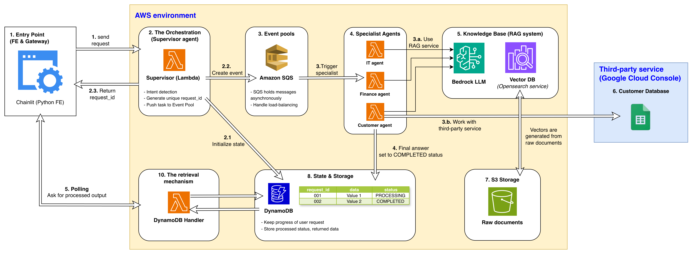

# Event-driven Multi-agent Banking Virtual Assistant

## Problem

In addition to serving customers, bank employees must manage large volumes of internal information, including confidential documents, transaction records, customer inquiries, etc. This data is frequently updated, often unstructured, and sometimes inconsistent, making it difficult to retrieve accurate information efficiently using traditional search systems.

## Solution

To address these challenges, we propose an **event-driven, multi-agent banking virtual assistant** built on top of AWS services.

- **Multi-agent architecture**: Rather than relying on a single monolithic agent, the system is composed of multiple specialized agents, each responsible for a specific domain (e.g., customer support, internal IT systems, compliance). This modular design improves accuracy, maintainability, and task efficiency.

- **Event-driven architecture**: Agents interact through an event-driven architecture, enabling asynchronous coordination, loose coupling, and scalable execution across workflows.

Overall, the system provides the following capabilities:

- **Intelligent information retrieval**: Employees can query the system using natural language, and the appropriate agents will retrieve relevant information from heterogeneous internal data sources.

- **Task automation**: Agents are integrated with predefined tools and services, allowing them to execute domain-specific actions and automate operational workflows.

*Note: This project is a conceptual implementation and for learning purposes only. The provided capabilities are illustrative and not intended for production use.*

## Architecture Diagram

<p align="center">
    
</p>

## How to run this project

### Prerequisites

Before running this project, ensure the following requirements are met:
- An AWS account with sufficient permissions to provision and manage resources.
- AWS CLI installed and properly configured on your local machine.
-AWS CDK installed globally via npm.
- Python 3.11 or later installed.

### Manual Setup (AWS Console)
Complete the following setup steps in the AWS Management Console before deployment:
- Create an S3 bucket and upload data in `data/` folder to the bucket.
- Create knowledge bases (KBs) in AWS Bedrock corresponding to each agent, copy the KB IDs, and directly paste them into the `cdk/stack.py` file.
- Create SQS queues for each agent and setup the triggering mechanism to invoke the corresponding Lambda functions when messages are received.

### Deployment

Pull the code and deploy the system using AWS CDK:

```bash
# Create virtual environment
python -m venv .venv
source .venv/bin/activate  # On Windows: .venv\Scripts\activate

# Install dependencies
pip install -r requirements.txt

# Bootstrap CDK (if first time using CDK in this account/region)
cdk bootstrap

# Review planned deployment
cdk diff

# Deploy the multi-agent system
cdk deploy --all

# Get outputs including API endpoint
cdk output
```

### Connect to external data source (Google Spreadsheet)

To integrate a Google Spreadsheet and test the system, complete the following steps:
- In Google Cloud Console, create a new project and enable the Google Sheets API.
- Create a service account with the required permissions (e.g., access to Google Sheets).
- Configure Workload Identity Federation:
    - Create a workload identity pool and provider (e.g., AWS as the identity provider).
    - Grant the external identity permission to impersonate the Google service account (roles/iam.workloadIdentityUser).
- Configure AWS to federate with Google Cloud:
    - Set up an IAM role that your application (e.g., Lambda) will assume.
    - Ensure the role is trusted by the Google WIF provider.
- Update your application to use WIF instead of static credentials:
    - Use Google’s external account credentials configuration (no JSON key file).
    - Store the WIF configuration (e.g., external_account.json) in your project and load it at runtime.
- Create a Google Spreadsheet, grant access to the service account email, and obtain the spreadsheet ID.